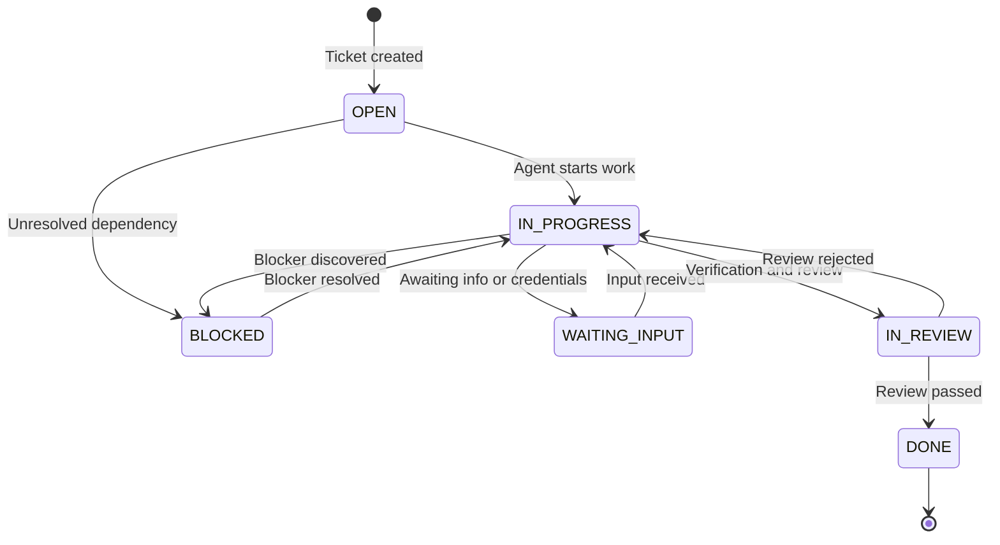

# ZAF Ticket Standard

This document defines the canonical Markdown-based schema, lifecycle transitions and hygiene protocols for tickets within ZAF, the Zero-to-one Agent Framework.

ZAF operates on a "file system as database" philosophy. Every task is represented by a single, self-contained Markdown file. This ensures transparency, auditability and local-first offline execution.

## Ticket file schema (frontmatter)

Every ticket file lives under `WIP/tickets/ACTIVE/`, `WIP/tickets/OPEN/`, `WIP/tickets/BLOCKED/` or `WIP/tickets/DONE/` and begins with a YAML frontmatter block.

### Standard template

```yaml
---
id: TKT-ZAF-0000
title: Concise, action-oriented title
status: OPEN
programme: PROG-ZAF-001
workstream: WS-NAME
phase: P0
priority: P1
project: ZAF
repo: zaf
team: engineering
roles: [engineering, review]
archetype: BUILD
blocks: [TKT-ZAF-0001]
blocked_by: []
created: YYYY-MM-DD
updated: YYYY-MM-DD
usage_checkpoint: LOW
---
```

### Frontmatter field definitions

| Field | Type | Description |
|---|---|---|
| `id` | String | Globally unique identifier in the format `TKT-ZAF-NNNN` for ZAF tickets. |
| `title` | String | High-level description of what the ticket accomplishes. |
| `status` | String | One of `OPEN`, `IN_PROGRESS`, `WAITING_INPUT`, `BLOCKED`, `IN_REVIEW`, `DONE`. |
| `programme` | String | Parent programme ID, for example `PROG-ZAF-001`. |
| `workstream` | String | Workstream prefix, for example `WS-DASHBOARD`, `WS-DOCS`. |
| `phase` | String | Target phase gate, for example `P1`, `P2`, `P3`. |
| `priority` | String | `P0` critical blocker, `P1` high, `P2` medium, `P3` nice to have. |
| `repo` | String | Folder name of the target repository in the workspace. |
| `team` | String | Responsible team, for example `engineering`, `design`, `ops`. |
| `roles` | Array | Agent roles eligible to work on the ticket. |
| `archetype` | String | `BUILD` (code changes), `DOCS` (documentation), `AUDIT` (verification or infrastructure). |
| `blocks` | Array | Ticket IDs that are blocked by this ticket. |
| `blocked_by` | Array | Ticket IDs that must be completed before this ticket can start. |
| `created` | Date | Creation date in `YYYY-MM-DD`. |
| `updated` | Date | Last modification date in `YYYY-MM-DD`. |
| `usage_checkpoint` | String | Token usage expectation: `LOW`, `MEDIUM`, `HIGH`. |

## Ticket lifecycle

Tickets flow through a deterministic status state machine. Transitions are monitored by the operator or by an orchestrating agent.



### Transition protocols

- Archiving. When a ticket's status is changed to `DONE`, the file is moved to `WIP/tickets/DONE/`.
- Index syncing. The central `WIP/tickets/TICKETS.md` file mirrors directory state. Whenever a file is created, archived or updated, the active index is rewritten to match disk reality.

## Handoff Log standards

Every ticket must end with a `## Handoff Log` section. The Handoff Log is the single source of truth for chronological state during multi-agent or cross-session handoffs.

### Entry format

```markdown
- YYYY-MM-DD | [agent-role-or-user] | [TARGET_STATUS]. Detailed description of action taken, remaining risk and target next steps.
```

### Rules

1. Append-only. Handoff logs are strictly chronological and cumulative. Never edit or delete previous entries.
2. State handshake. If an agent pauses due to a blocker, it must write a detailed entry describing exactly what is blocking it and update the ticket status to `BLOCKED` or `WAITING_INPUT`.
3. Self-contained. A cold-start agent reading the ticket plus the last handoff entry must be able to understand the exact status of the task and continue execution without needing outside conversational context.

## Ticket hygiene rules

1. No deletions. Agents must not delete a ticket file. Rejected or aborted tasks are preserved by setting their status appropriately and moving them to `DONE/`.
2. No side effects. Agents should not update a ticket file outside the `status`, `updated` and `Handoff Log` sections, unless editing description copy under the `## Context` or `## Task` headers.
3. Local sync. Before starting work on any ticket, the agent should pull the latest workspace state and commit changes upon completion.
