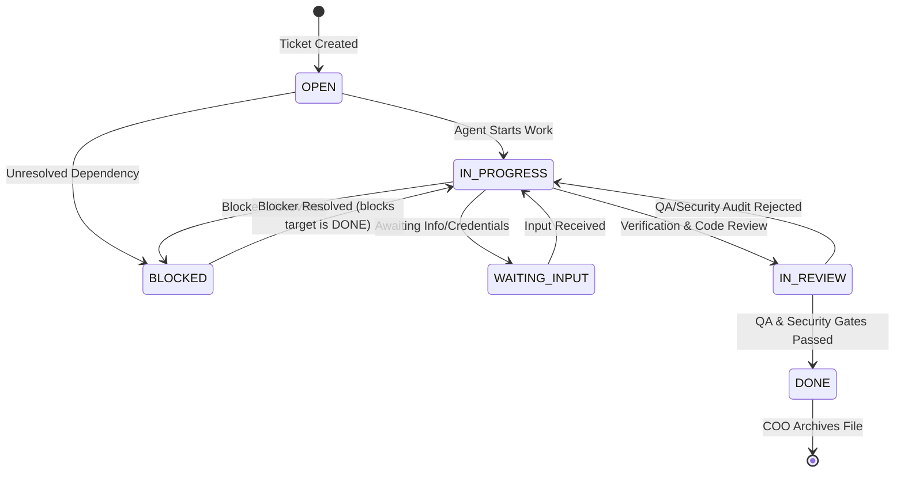

# ZAF Ticket Standard

This document defines the canonical markdown-based schema, lifecycle transitions, and hygiene protocols for tickets within the **ZO Agentic Framework (ZAF)**. 

ZAF operates on a **"Filesystem as Database"** philosophy: every task is represented by a single, self-contained markdown file. This ensures complete transparency, auditability, and local-first offline execution.

---

## 📄 Ticket File Schema (Front-Matter)

Every ticket file must reside in either `WIP/tickets/ACTIVE/` or `WIP/tickets/ARCHIVED/` and begin with a YAML front-matter block. 

### Standard Template:
```yaml
---
id: TKT-XYZ-0000
title: Concise, action-oriented title
status: OPEN
programme: PROG-XYZ-000
workstream: WS-NAME
phase: P0
priority: P1
project: Target Project Name
repo: target-repo-id
team: engineering
roles: [agent-role-1, agent-role-2]
archetype: BUILD
blocks: [TKT-XYZ-0001]
blocked_by: []
created: YYYY-MM-DD
updated: YYYY-MM-DD
usage_checkpoint: LOW
---
```

### Front-Matter Field Definitions:

| Field Name | Type | Description |
|---|---|---|
| **`id`** | String | Globally unique identifier following the format `TKT-[REPO]-[NUMBER]`. |
| **`title`** | String | A high-level description of what the ticket accomplishes. |
| **`status`** | String | Must be exactly one of: `OPEN`, `IN_PROGRESS`, `WAITING_INPUT`, `BLOCKED`, `IN_REVIEW`, `DONE`. |
| **`programme`** | String | The parent program ID (e.g., `PROG-ZAF-001`). |
| **`workstream`** | String | The specific workstream prefix (e.g., `WS-DASHBOARD`, `WS-DOCS`). |
| **`phase`** | String | The target phase gate (e.g., `P1`, `P2`, `P3`). |
| **`priority`** | String | Priority tier: `P0` (critical blocker), `P1` (high), `P2` (medium), `P3` (nice-to-have). |
| **`repo`** | String | The folder name of the target repository in the workspace. |
| **`team`** | String | The responsible team department (e.g., `engineering`, `design`, `ops`). |
| **`roles`** | Array | List of agent roles eligible to work on the ticket. |
| **`archetype`** | String | One of: `BUILD` (code changes), `DOCS` (documentation), `AUDIT` (verification/infra). |
| **`blocks`** | Array | List of ticket IDs that are blocked by this ticket. |
| **`blocked_by`** | Array | List of ticket IDs that must be completed before this ticket can start. |
| **`created`** | Date | Creation date in ISO format `YYYY-MM-DD`. |
| **`updated`** | Date | Last modification date in ISO format `YYYY-MM-DD`. |
| **`usage_checkpoint`** | String | Token usage intensity expectation: `LOW`, `MEDIUM`, `HIGH`. |

---

## 🔄 The Ticket Lifecycle

Tickets flow through a deterministic status state machine. Transitions are monitored and managed by the COO agent or human operators.



### Transition Protocols:
*   **Archiving**: When a ticket's status is changed to `DONE`, the ticket file must be moved from the `ACTIVE/` directory to the `ARCHIVED/` directory. 
*   **Index Syncing**: The central `TICKETS.md` file acts as the directory layout list. Whenever a file is created, archived, or updated, the active indices must be rewritten to match disk reality.

---

## ✍ Handoff Log Standards

Every ticket must end with a structured `## Handoff Log` section. The handoff log is the single source of truth for tracking chronological state history during multi-agent or cross-session handoffs.

### Handoff Log Entry Format:
```markdown
- YYYY-MM-DD | [agent-role-or-user] | [TARGET_STATUS] - Detailed description of action taken, remaining risk, and target next steps.
```

### Handoff Log Rules:
1.  **Append-Only**: Handoff logs are strictly chronological and cumulative. Never edit or delete previous entries.
2.  **State Handshake**: If an agent pauses execution due to a blocker, they must write a detailed log entry describing *exactly* what is blocking them and update the ticket status to `BLOCKED` or `WAITING_INPUT`.
3.  **Self-Containment**: A cold-start agent reading the ticket and the last handoff log entry must be able to understand the exact status of the task and continue execution without needing outside conversational context.

---

## 🛡 Ticket Hygiene Rules

To preserve system auditability and prevent workspace chaos, all agents must strictly follow these **Hygiene Laws**:
1.  **No Deletions**: Under no circumstances should an agent ever delete a ticket file. Even rejected or aborted tasks are preserved by setting their status to `DONE` (or `ABORTED`) and archiving them.
2.  **No Side Effects**: Agents should never update a ticket file outside the designated `status`, `updated`, and `Handoff Log` sections, unless specifically editing description copy under the `## Context` or `## Task` headers.
3.  **Local Sync Prioritization**: Before starting work on any ticket, the agent must pull the latest workspace state and commit changes immediately upon completion.
